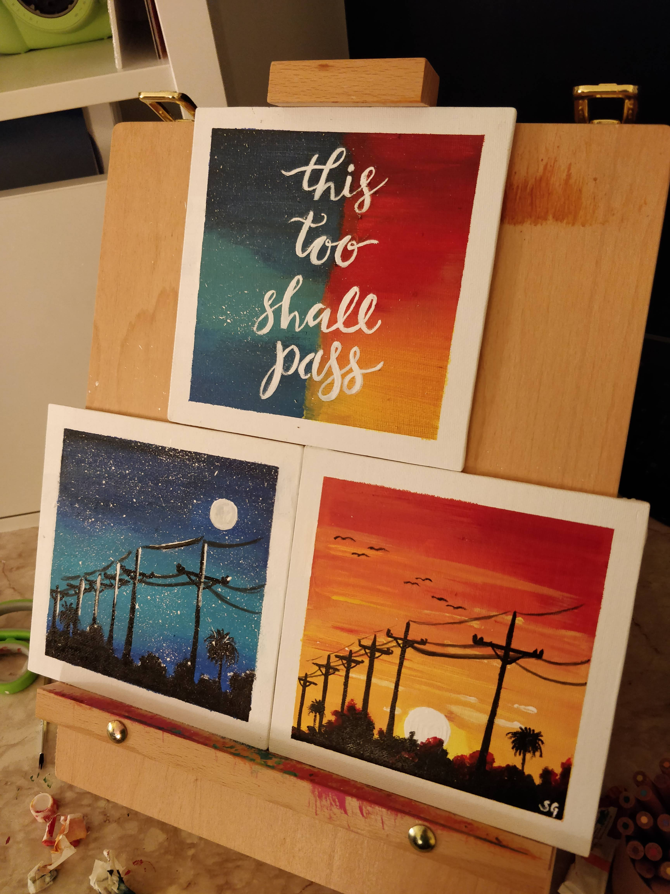
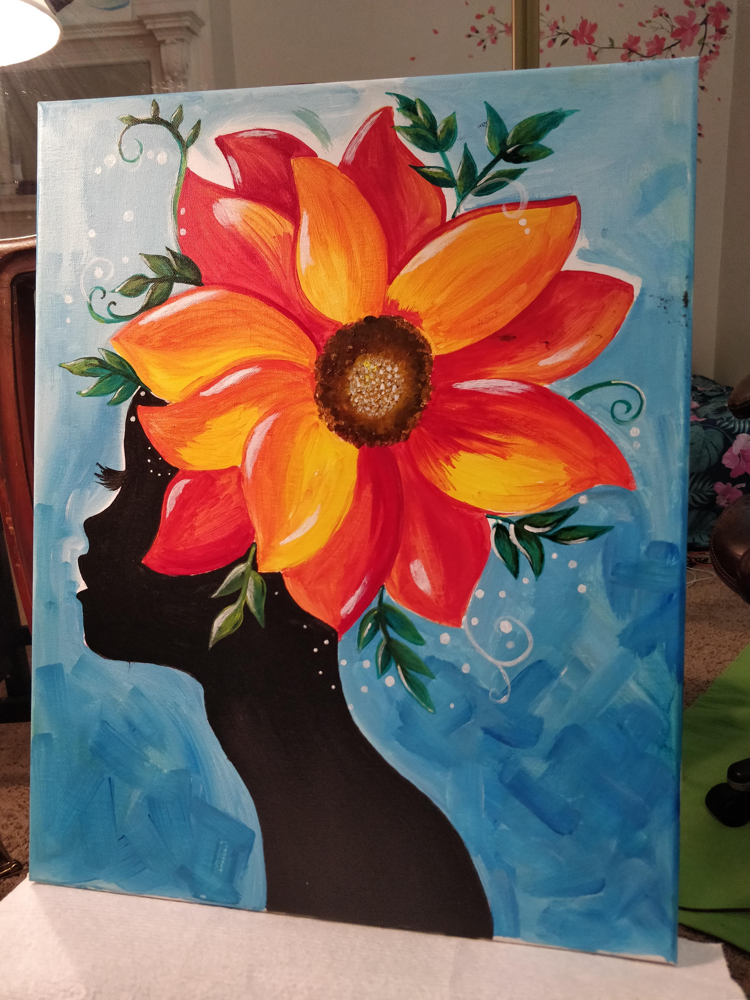
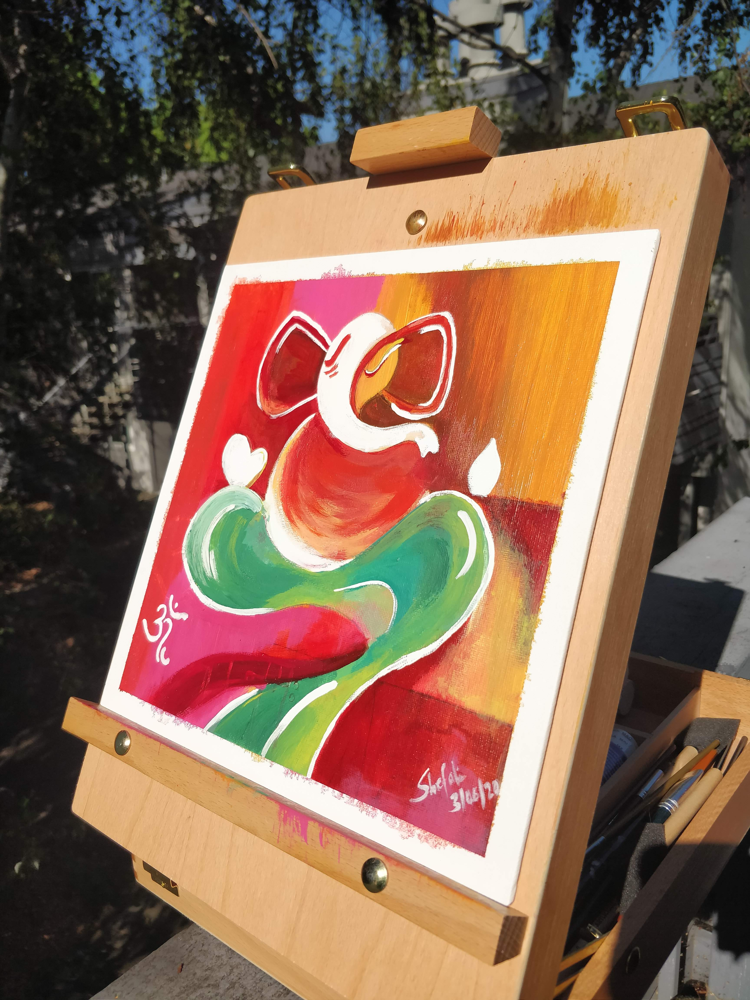
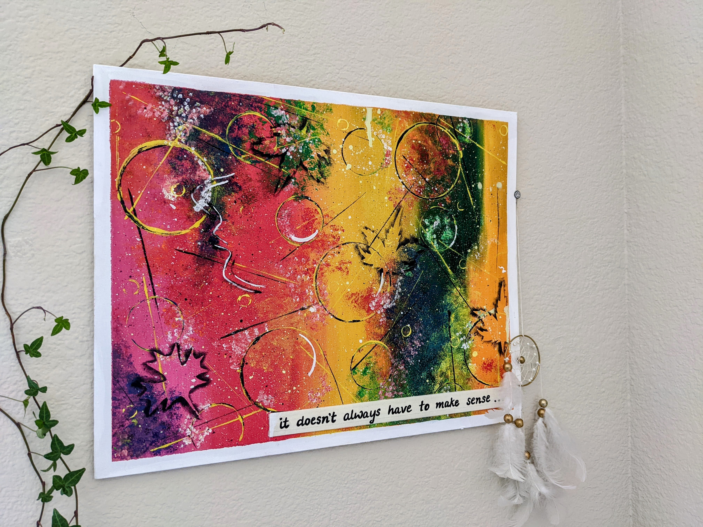
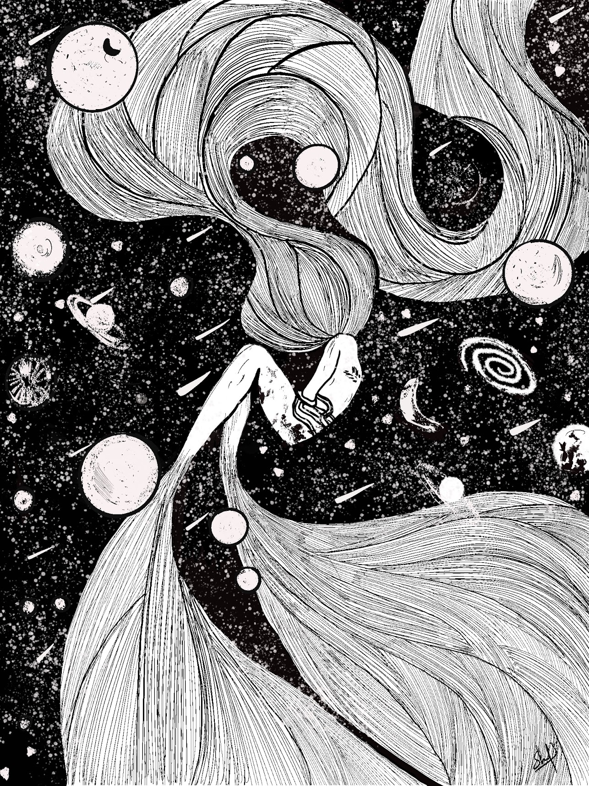
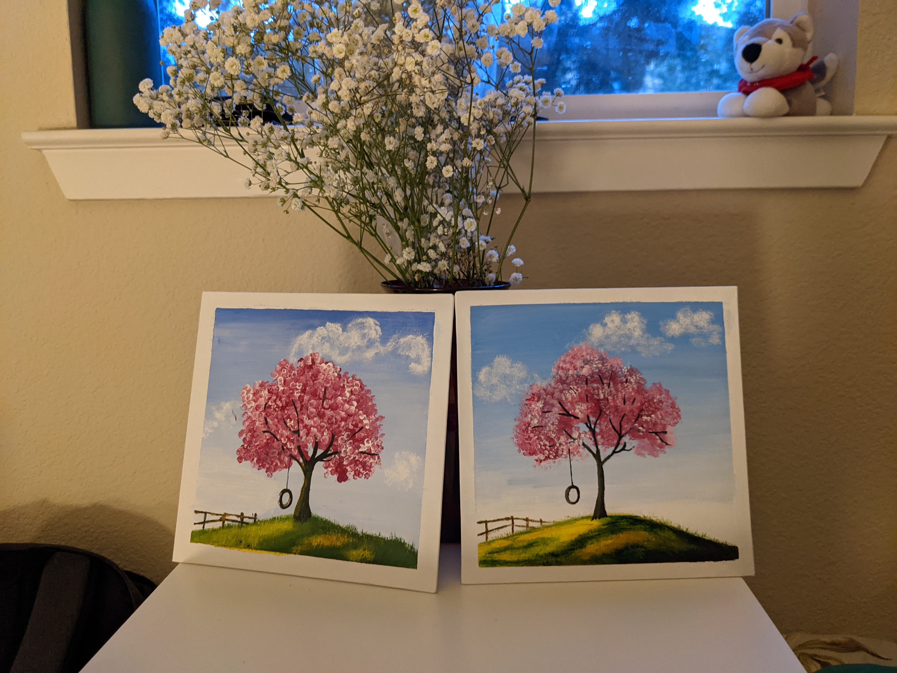
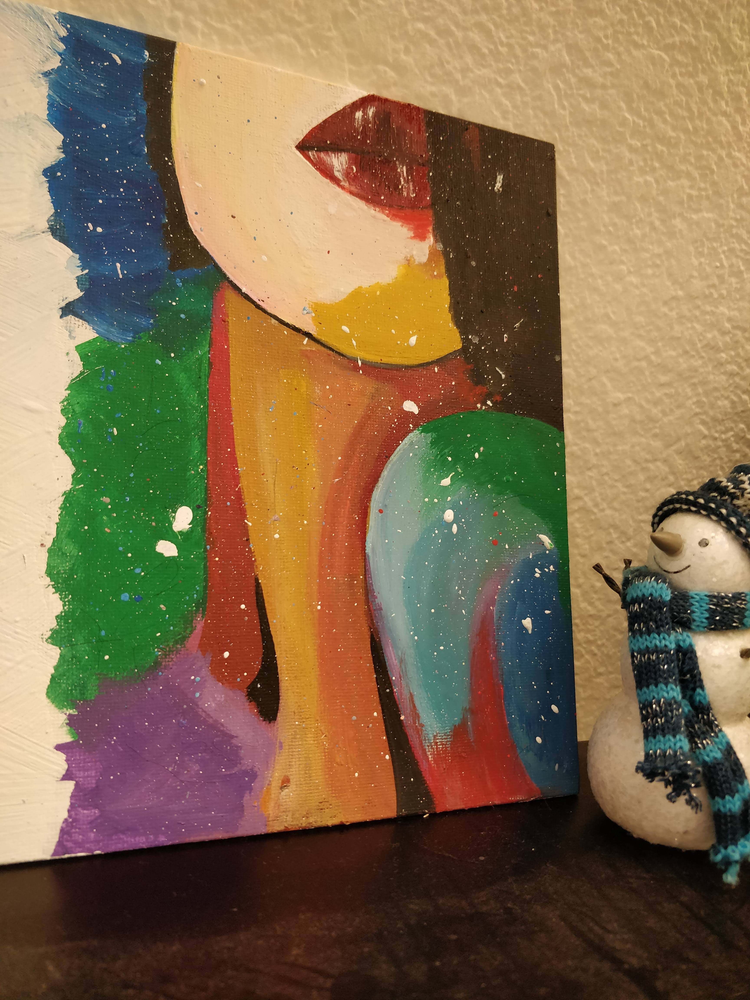
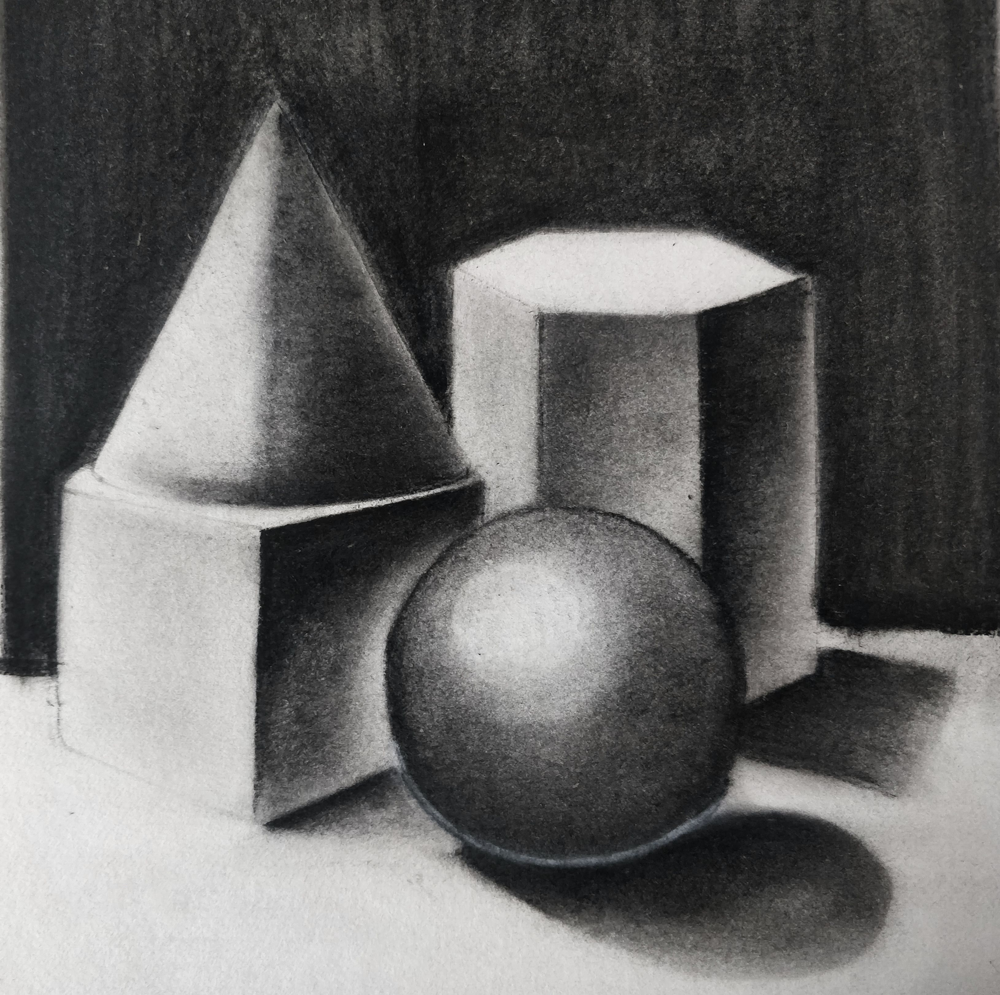
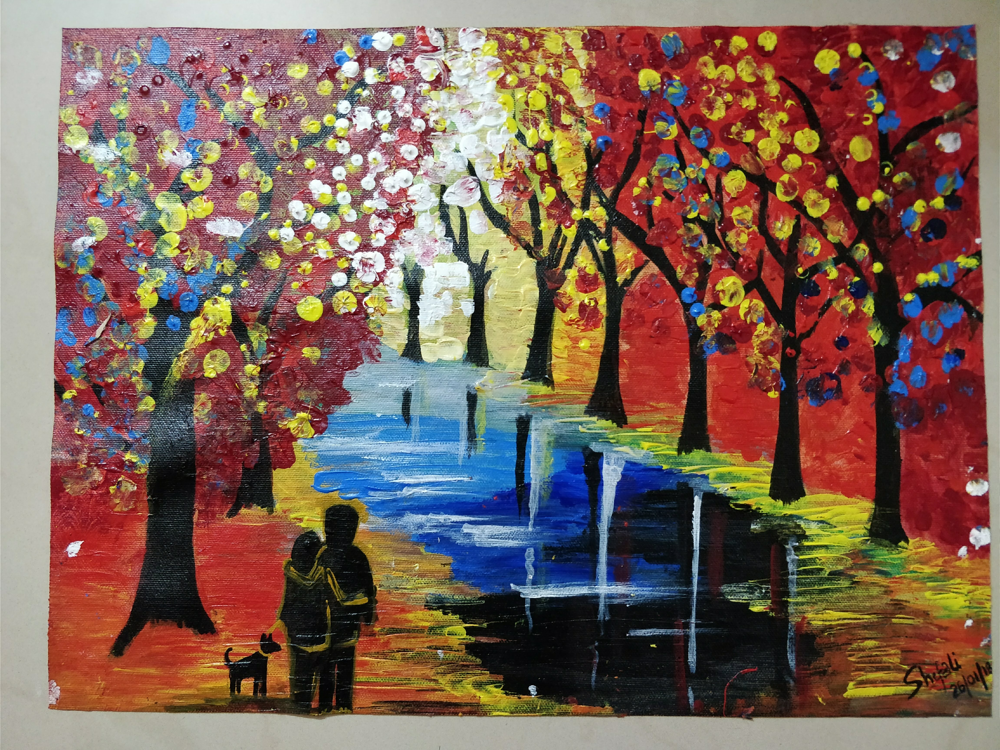

<!-- 
<h2>Some of my Art Works over the years :)</h2> -->

  

    
    
Title: The Answer To Everything :) Medium: Acrylic

  

  

    
    
Title: Wear Your Crown Medium: Acrylic

  

  

    
    
Title: The Beginnings With Lord Ganesha Medium: Acrylic

  

  

    
    
Title: It Doesn’t Always Have To Make Sense! Medium: Acrylic

  

  

    
    
Title: Dream Medium: Ink

  

  

    
    
Title: Friends Medium: Acrylic

  

  

    
    
Title: The Girl Medium: Acrylic

  

  

    
    
Title: The First Medium: Charcoal

  

  

    
    
Title: Walk Medium: Acrylic

  

