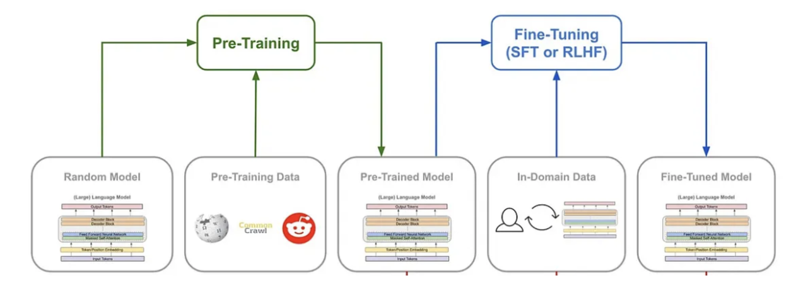
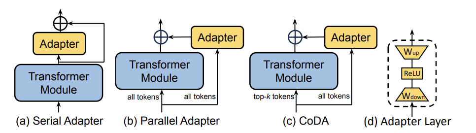
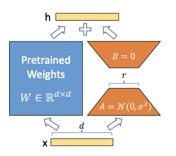
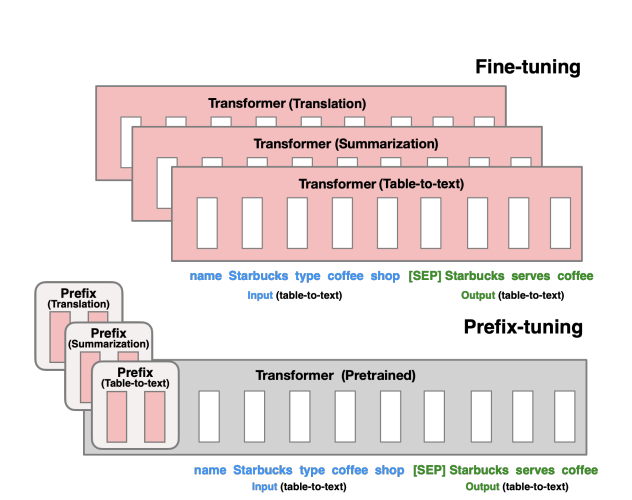
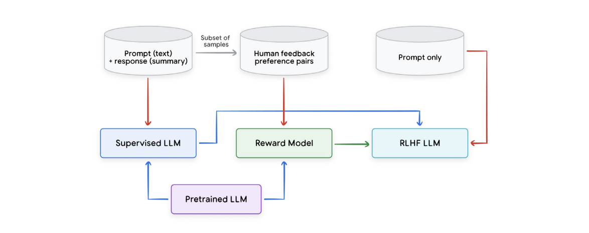

The success of large language models (LLMs) like Gemini, GPT-4 etc is not only due to their massive scale but also the sophisticated training strategies employed. In the [last post](https://shefali92.github.io/posts/tranformer/), we discussed about Transformers, the backbone of Large Language Models. In this post we'll talk about these training strategies.

Training an LLM is a multi-phase process, typically consisting of **pre-training**, followed by various methods of **fine-tuning** to adapt the model for specific tasks. Over time, new techniques such as **Supervised Fine-Tuning (SFT)**, **Parameter-Efficient Fine-Tuning (PEFT)**, and **Reinforcement Learning from Human Feedback (RLHF)** have emerged to address the need for more efficient, scalable, and human-aligned approaches to model training.

  <em>Figure 1: Broad Stages of Model Training</em> 
  <em>Image Ref: <a href="https://medium.com/@bijit211987/(the-evolution-of-language-models-pre-training-fine-tuning-and-in-context-learning-b63d4c161e49)" target="_blank">Blog</a></em>

----

### Pre-training: Learning General Language Representation

Pre-training is the first and most computationally expensive phase of training an LLM. During this phase, the model is trained on vast amounts of raw text data from diverse sources (books, websites, Wikipedia, news articles, etc.). The objective here is not to perform any specific task but to learn general patterns, syntax, semantics, and structure of language.

#### Key Details:

* **Unsupervised Learning**: Pre-training is typically done in an unsupervised manner. The model learns by predicting the next word (or token) in a sentence given the previous words. This is done using an objective called **masked language modeling (MLM)** or **autoregressive language modeling**.  
  * **MLM (BERT- style)**: Random words in a sentence are masked, and the model learns to predict these masked words based on the context.  
  * **Autoregressive (GPT \- style)**: The model generates text token by token, predicting the next token in a sequence, conditioned on the previous tokens.  
* **Training Objective**: The goal of pre-training is to optimize the model to generate meaningful text sequences, thereby learning intricate relationships between words and concepts. This phase often uses a **cross-entropy loss** between the predicted and actual tokens.  
* **Scalability**: Pre-training relies on enormous datasets and is computationally intensive, requiring vast amounts of data and computing power (often thousands of GPUs or TPUs over weeks or months). As the model grows in scale, the data and computational requirements also scale up.

#### Benefits:

* **General Knowledge**: The pre-trained model accumulates a wealth of knowledge about language structure, common facts, and even world knowledge. However, it is still a general-purpose model and does not specialize in any particular domain or task.  
* **Transfer Learning**: This phase allows the model to be later adapted to specific tasks through fine-tuning, enabling the transfer of learned representations to a variety of downstream applications like question answering, text generation, and sentiment analysis.

#### Recommended Reading:

1. [BERT: Pre-training of Deep Bidirectional Transformers for Language Understanding](https://arxiv.org/abs/1810.04805) by Jacob Devlin et al. (). This paper introduces BERT, a popular transformer model, and provides the foundational ideas behind pre-training and fine-tuning for language tasks.  
2. [Improving Language Understanding by Generative Pre-Training](https://cdn.openai.com/research-covers/language-unsupervised/language_understanding_paper.pdf) by Open AI  
3. Blog for Understanding GPT2: [https://jalammar.github.io/illustrated-gpt2/](https://jalammar.github.io/illustrated-gpt2/)  
4. Blog for Understanding GPT3: [https://jalammar.github.io/how-gpt3-works-visualizations-animations/](https://jalammar.github.io/how-gpt3-works-visualizations-animations/)

---

### Supervised Fine-tuning (SFT): Adapting the Model for Specific Tasks

Fine-tuning is the second phase, where a pre-trained model is adapted to perform well on specific tasks. Unlike pre-training, which is performed on generic, unstructured data, fine-tuning uses task-specific datasets (e.g., a dataset for text classification, named entity recognition, etc.).   
The model, having already learned general language patterns, now fine-tunes its parameters to optimize its performance on these specialized tasks.

Supervised fine-tuning (SFT) takes the pre-trained model and adjusts its weights using a labeled dataset for a particular downstream task. This is the most straightforward and traditional form of fine-tuning.

#### Key Details:

* **Objective**: In SFT, the model's behavior is tailored to fit a specific objective by minimizing the error between the model's predictions and the true labels for a supervised task using gradient-based optimization algorithms (commonly stochastic gradient descent or its variants such as Adam). Examples of such tasks include text classification, named entity recognition, or question answering.  
* **Parameters**: During SFT, the entire model, or selected layers, is updated based on the gradients computed from the error between the predicted output and the ground truth.  
* **Loss Function**: During SFT, the model typically optimizes for a **cross-entropy loss** for classification tasks or **mean squared error** for regression tasks. This enables the model to specialize in the particular task at hand.  
* **Data Requirements**: Fine-tuning typically requires a labeled dataset, often much smaller in size compared to the massive corpus used for pre-training. However, fine-tuning on smaller datasets can still yield significant performance gains for specific applications.  
* **Limitations**: Although SFT is powerful, it can be data-intensive and may not always provide optimal performance for tasks with small or limited datasets. Additionally, it can be time-consuming to train large models with millions or billions of parameters.

#### Recommend Reading:

* [Language Models are Few-Shot Learners](https://arxiv.org/abs/2005.14165) by Tom B. Brown et al. This paper introduces GPT-3 and demonstrates how supervised fine-tuning allows LLMs to perform well in a few-shot learning setup.

To address the above mentioned limitations, more efficient fine-tuning strategies have been developed, such as **Parameter-Efficient Fine-Tuning (PEFT)** and **Reinforcement Learning from Human Feedback (RLHF)**.

---

### Parameter-Efficient Fine-Tuning (PEFT): A More Efficient Approach

As the cost of training large models continues to increase, PEFT offers a more efficient alternative to traditional fine-tuning methods by focusing on modifying smaller components of a model (e.g., specific attention heads, embeddings, or even the prompt structure) instead of updating the entire network.

The central idea is to retain the majority of the pre-trained model’s parameters frozen (i.e., not updated during training) and only adjust a minimal set of parameters that are critical for the specific downstream task.

#### **Techniques in PEFT:**

* **Adapters**: Adapters are small modules inserted between layers of a pre-trained model. Figure below shows the different ways that the adapter layer can be inserted. These modules are trainable, while the rest of the model's parameters are kept frozen. This allows the model to learn task-specific representations while minimizing the number of parameters that require optimization.

 

  <em>Figure 2: Illustration of 3 representative adapter-based finetuning algorithms. Blue represents frozen, while yellow represents trainable parameters.</em> 
  <em>Image Ref: <a href="https://arxiv.org/pdf/2403.14608" target="_blank">arXiv Paper</a></em>

* **LoRA (Low-Rank Adaptation)**: LoRA proposes modifying only the low-rank matrices in the model, while keeping the original weights frozen. LoRA allows us to train some dense layers in a neural network indirectly by optimizing rank decomposition matrices of the dense layers’ change during adaptation instead, while keeping the pre-trained weights frozen, as shown in Figure 2.,This approach effectively reduces the number of trainable parameters by approximating weight updates with low-rank matrix decompositions, making it more computationally efficient.  
    
   

  <em>Figure 3: The weight matrix is reparametrized into smaller matrices A and B. Only A and B are updated during training.</em> 
  <em>Image Ref: <a href="https://arxiv.org/pdf/2106.09685" target="_blank">arXiv Paper</a></em>

* **Prefix Tuning**: This method introduces trainable vectors (prefixes) as shown in Figure 4 that are prepended to the model's input tokens. The model then learns to adjust these prefixes for specific tasks, enabling task adaptation with minimal parameter updates.  

  <em>Figure 4: Fine-tuning (top) updates all Transformer parameters (the red Transformer box) and requires storing a full model copy for each task. Prefix-tuning (bottom), freezes the Transformer parameters and only optimizes the prefix (the red prefix blocks).</em> 
  <em>Image Ref: <a href="https://arxiv.org/pdf/2101.00190" target="_blank">arXiv Paper</a></em>

* **Prompt Tuning**: Similar to prefix tuning, this approach involves learning task-specific "prompts" that are combined with the input data, allowing the model to adjust its response without modifying the model’s underlying parameters

####  Key Details:

* **Methodology**: PEFT focuses on optimizing a small number of model parameters or components that influence the model's behavior the most. This allows the model to adapt to specific tasks with fewer parameters, drastically reducing the computational cost of fine-tuning.  
* **Efficiency**: Rather than re-training the entire model, PEFT often focuses on adjusting specific prompts or lightweight modules, which allows large language models to be more adaptable and resource-efficient.  
* **Few-shot and Zero-shot Learning**: PEFT is particularly useful in few-shot or zero-shot learning settings, where task-specific data is limited. By fine-tuning only a small portion of the model, PEFT can quickly adapt the model to new tasks using very few examples.  
* **Benefits**: Significantly reduced memory requirements and faster training times compared to full fine-tuning. Additionally, PEFT methods often achieve competitive performance with far fewer parameters being updated, making them highly suitable for resource-constrained environments.  
* **Limitations**: PEFT methods often require careful tuning of the low-rank or adapter parameters to ensure the quality of the learned task-specific representations. Furthermore, some techniques, like prefix or prompt tuning, may have limitations in modeling more complex task-specific nuances that require deeper adaptation of the model’s weights.

#### Recommended Reading:

1. Adapter Paper : [\[1902.00751\] Parameter-Efficient Transfer Learning for NL](https://arxiv.org/abs/1902.00751)  
2. LORA Paper : [\[2106.09685\] LoRA: Low-Rank Adaptation of Large Language Models](https://arxiv.org/abs/2106.09685)  
3. Prefix Tuning Paper: [\[2101.00190\] Prefix-Tuning: Optimizing Continuous Prompts for Generation](https://arxiv.org/abs/2101.00190)  
4. Hugging Face Prefix Tuning Blog: [Prefix tuning](https://huggingface.co/docs/peft/en/package_reference/prefix_tuning)  
5. Hugging Face Prompt Tuning Blog: [Prompt tuning](https://huggingface.co/docs/peft/en/package_reference/prompt_tuning)  
6. Prompt Tuning Paper: [\[2104.08691\] The Power of Scale for Parameter-Efficient Prompt Tuning](https://arxiv.org/abs/2104.08691)

---

### Reinforcement Learning from Human Feedback (RLHF): Aligning with Human Preferences

Reinforcement Learning from Human Feedback (RLHF) is an advanced fine-tuning strategy that goes beyond traditional supervised learning by incorporating human feedback directly into the training process. RLHF has become increasingly important in domains where alignment with human values, preferences, or ethical standards is crucial.

####  RLHF Process

As shown in the Figure 5, the process of RLHF typically involves the following steps:

 

  <em>Figure 5: An example of RLHF procedure</em> 
  <em>Image Ref: <a href="https://drive.google.com/file/d/1mFvTxfuJg4VNutn9wBvH_URznLRkklb3/view" target="_blank">Newwhitepaper_Foundational Large Language models & text generation.pdf</a></em>

1. **Pre-training**: A large pre-trained LLM is first trained on a broad corpus of text (using unsupervised or supervised learning).  
2. **Reward Model Training**: In parallel, human evaluators provide feedback on model outputs, often through ranking responses or assigning scores based on specific criteria such as relevance, coherence, or safety. These feedback signals are used to train a reward model, which learns to predict the quality of model outputs.  
3. **Reinforcement Learning (RL)**: The pre-trained model is then fine-tuned using reinforcement learning algorithms (such as Proximal Policy Optimization or PPO). The model generates responses to various prompts, and the reward model provides feedback on these outputs. The model's parameters are updated based on the rewards, guiding the system toward producing higher-quality outputs over time.

#### Key Details:

* **Human-in-the-loop**: RLHF integrates human feedback into the reinforcement learning framework, where human evaluators provide feedback on model outputs in the form of rankings, preferences, or even direct corrections. This feedback guides the model toward more human-aligned behavior.

* **Reinforcement Learning**: In RLHF, the model is treated as an agent interacting with an environment, where the feedback (often in the form of a reward signal) serves as the environment’s response to the agent’s actions. The model adjusts its policies (i.e., behavior) to maximize the expected reward, which is designed to reflect human preferences.

* **Applications and Benefits:** It has shown significant success in aligning models with human preferences, enhancing aspects like factual accuracy, coherence, and safety in generated content. One of the primary advantages of RLHF is its ability to optimize for complex, subjective metrics, which are difficult to capture using traditional supervised learning.

* **Challenges:** RLHF introduces several challenges, particularly around the quality and consistency of human feedback. Human annotators may introduce biases, and there is also the problem of reward model overfitting. Furthermore, RL algorithms often require substantial computational resources, especially when fine-tuning models with large numbers of parameters.

Despite these challenges, RLHF has proven effective in fine-tuning models making them more useful in real-world applications like chatbots, content generation, and recommendation systems, where human-like reasoning and alignment are necessary.

#### Recommended Reading:

* [Deep Reinforcement Learning from Human Preferences](https://arxiv.org/abs/1706.03741) by Christiano et al.  
  This seminal paper describes the RLHF approach and how reinforcement learning can be used to train agents based on human feedback.  
* [Learning to Summarize with Human Feedback](https://arxiv.org/abs/2009.01325) by Nisan Stiennon et al.  
  This paper explores how RLHF can be used for text summarization tasks, demonstrating its effectiveness in aligning model outputs with human preferences.  
* Another interesting blog on RLHF, which explains the topic in detail: [RLHF: Reinforcement Learning from Human Feedback](https://huyenchip.com/2023/05/02/rlhf.html)

---

## Comparison of Pretraining, SFT, PEFT, and RLHF

| **Aspect**               | **Pretraining**                                | **SFT (Supervised Fine-Tuning)**                      | **PEFT (Parameter-Efficient Fine-Tuning)**             | **RLHF (Reinforcement Learning with Human Feedback)**  |
|--------------------------|-----------------------------------------------|------------------------------------------------------|------------------------------------------------------|------------------------------------------------------|
| **Purpose**              | Learn general language patterns.              | Specialize for specific tasks.                       | Fine-tune efficiently with fewer parameters.         | Align with human preferences.                        |
| **Data Type**            | Large unlabeled text data.                    | Labeled task-specific data.                          | Labeled data + minimal task-specific changes.        | Labeled data + human feedback.                      |
| **Learning Mechanism**   | Self-supervised (e.g., MLM, next token).      | Supervised learning on labeled data.                 | Fine-tune small parameters, freeze others.           | Reinforcement learning with human feedback as reward.|
| **Training Goal**        | Generalize across tasks.                      | Optimize for specific tasks.                         | Reduce fine-tuning costs and resource use.           | Align model behavior with human feedback.           |
| **Pros**                 | Scalable, generalizes well.                   | High performance on specific tasks.                   | Fast, efficient fine-tuning.                         | Aligns with human values.                           |
| **Cons**                 | Expensive, not task-specific.                 | Requires large labeled datasets.                     | May not achieve best performance.                    | Expensive, depends on quality feedback.             |

##  **Conclusion**

Training large language models is a complex, multi-stage process that involves both **pre-training** on vast, generic datasets and **fine-tuning** on specific tasks. The traditional approach to fine-tuning, **Supervised Fine-Tuning (SFT)**, has been highly effective but is computationally expensive. Newer techniques like **Parameter-Efficient Fine-Tuning (PEFT)** provide more efficient alternatives for adapting models with fewer parameters and less data. Finally, **Reinforcement Learning from Human Feedback (RLHF)** goes one step further by incorporating human preferences into the training process, ensuring that models align with human values and expectations.

I hope you enjoyed the article and found it helpful. If you have any questions or would like to explore the topic further, feel free to reach out\!  **Happy Reading**\! :D 