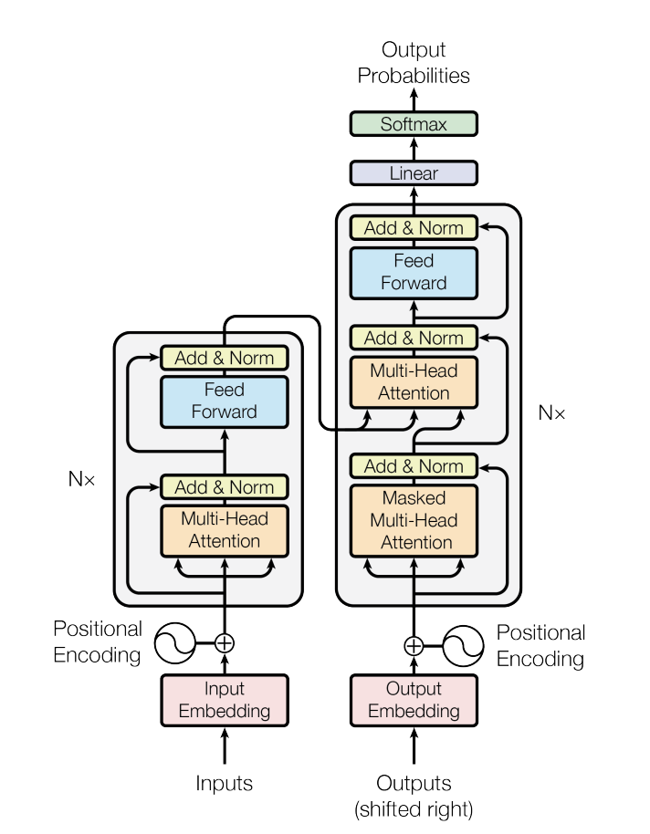

# Topic 1: Transformers and Attention – The Backbone of LLMs

Welcome to the first deep dive in the series\! In this topic, we'll explore **Transformers and Attention**, two concepts that form the core of modern Large Language Models (LLMs) like Gemini and GPT. But before we dive into this, it’s important to have a basic understanding of **Machine Learning** and **Deep Learning** concepts. If you're new to these topics, don’t worry\! You can check out these excellent courses to build foundational knowledge.

**Course Recommendations:** 
1. [**Machine Learning Specialization (Stanford & DeepLearning.AI) | Coursera**](https://www.coursera.org/specializations/machine-learning-introduction) **\-** A beginner-friendly, 3-course program by AI visionary Andrew Ng for fundamental AI and ML concepts.  
2. [**DeepLearning.AI’s Deep Learning Specialization on Coursera**](https://www.coursera.org/specializations/deep-learning) – A comprehensive and Intermediate level- series to get you up to speed with the basics of deep learning with neural nets.

----------------------------------------------------------------------------------------------------------------------------------------------

## What is Language Modeling?
**Language modeling** is the task of predicting the next word or sequence of words in a sentence based on the preceding context. It involves understanding the structure, grammar, and meaning of language, which enables a model to generate coherent and contextually appropriate text. Language models are trained on large corpora of text and learn the statistical relationships between words or tokens, which allows them to predict how likely a word is to appear next in a sequence. 

The model generates text by considering previous words (or tokens) and using that context to generate the next word, phrase, or sentence. For example:

* **Context:** "The weather today is"  
* **Prediction:** "sunny" (or any other word that fits based on the model’s training)

Language models are widely used in many NLP tasks, Text Generation and Summarization, Machine Translation etc. Traditional language models, like [**n-gram models**](https://en.wikipedia.org/wiki/Word_n-gram_language_model), used simple statistical methods to predict the next word based on the preceding ones. However, modern deep learning-based language models use more powerful neural networks to learn more complex patterns and relationships within the language.

Before Transformers, models like **Recurrent Neural Networks (RNNs)** and **Long Short-Term Memory (LSTM)** networks were used for sequence processing. RNNs and LSTMs processed text one token at a time, maintaining a memory of previous tokens. However, they struggled with long-range dependencies, as their memory faded over long sequences, making it difficult to capture relationships in complex texts.

### Reading Recommendations :

1. Excellent Blog for understanding LSTMs: [https://colah.github.io/posts/2015-08-Understanding-LSTMs/](https://colah.github.io/posts/2015-08-Understanding-LSTMs/)  
2. Why LSTM/RNN Fail: [https://towardsdatascience.com/the-fall-of-rnn-lstm-2d1594c74ce0](https://towardsdatascience.com/the-fall-of-rnn-lstm-2d1594c74ce0)  
3. Sequence to Sequence Models: [Understanding Encoder-Decoder Sequence to Sequence Model | by Simeon Kostadinov | Towards Data Science](https://towardsdatascience.com/understanding-encoder-decoder-sequence-to-sequence-model-679e04af4346)

### Research Papers :

1. [\[1409.3215\] Sequence to Sequence Learning with Neural Networks](https://arxiv.org/abs/1409.3215)

The **Transformer** architecture solves this by utilizing **attention mechanisms** to enable parallel processing of data and capturing dependencies regardless of their distance in a sequence.

----------------------------------------------------------------------------------------------------------------------------------------------

## What are Transformers And Attention ?

**Transformers** are the backbone of modern Natural Language Processing (NLP) and are the primary architecture behind LLMs. Introduced by Google in 2017 in the groundbreaking paper **“[Attention is All You Need”](https://arxiv.org/abs/1706.03762)** [by Vaswani et al. (2017)](https://arxiv.org/abs/1706.03762), Transformers revolutionized the way we process sequences of data, particularly for language modeling. The Transformer architecture was initially developed for translation tasks. It is a sequence-to-sequence model designed to convert sequences from one domain to another, such as translating French sentences into English.   
The original Transformer architecture (shown in Figure 1\) consists of two main components: the encoder and the decoder. The encoder processes the input text (e.g., a French sentence) and transforms it into a numerical representation. This representation is then passed to the decoder, which generates the output text (e.g., an English translation) in an autoregressive manner, meaning one word is predicted at a time based on the previously generated words.

*Figure 1 : Original Transformer Architecture*
*(Ref: https://arxiv.org/abs/1706.03762)*

Don’t worry about the complex diagram above, and I don’t expect you to be familiar with terms like multi-head attention etc., just yet. :).  I’ll break down the key components of the Transformer for you and share the best resources to explore them in depth.

 These are the key components of a transformer model.

1. **Input Embedding/Output Embedding:**   
   1. Input embeddings are used to represent the input tokens (e.g., words or subwords) provided to the model, while output embeddings represent the tokens predicted by the model. For instance, in a machine translation task, the input embeddings correspond to words in the source language, and the output embeddings correspond to words in the target language.

2. **Positional Encoding:**   
   1. Since Transformers don’t process data sequentially (like RNNs), **positional encoding** is used to add information about the position of words in a sentence so that the model can understand the order of words.

3. **Attention:  This is the place where the magic happens \!**  
   1. Attention allows a model to focus on the most relevant parts of the input while processing a sequence. This is crucial for understanding language because words can have relationships that extend over long distances. For example, in the sentence **“The cat that chased the mouse was very fast”**, attention helps the model understand that “cat” and “was” are related, even though they are far apart.  
   2. The primary type of attention in Transformers is **self-attention**, which allows each word (or token) in a sequence to “attend” to all the other words in the sequence when making predictions. This capability enables the Transformer to capture contextual relationships at scale.  
      ![][image2]  
      Figure 2 : One word "attends" to other words in the same sentence differently.   
      *Ref:* https://lilianweng.github.io/posts/2018-06-24-attention/  
   3. **Multi-Head Attention:** Instead of having a single attention mechanism, **multi-head attention** uses multiple attention layers to learn different relationships in the data simultaneously. This allows the model to capture more diverse patterns.  
   4. **Masked Multi-Head Attention**: We force the model to only calculate attention corresponding to only the previous tokens that it has seen in the sentence and not for the future tokens. Used in the Decoder part of the transformer.

   **Blogs explaining attention in detail:**

1. [Visualizing A Neural Machine Translation Model (Mechanics of Seq2seq Models With Attention) – Jay Alammar](https://jalammar.github.io/visualizing-neural-machine-translation-mechanics-of-seq2seq-models-with-attention/)  
2. [Attention? Attention\! | Lil'Log](https://lilianweng.github.io/posts/2018-06-24-attention/)

2. **Feed-Forward Layers:**  
   1. After the attention layer, a feed-forward network is applied to transform the representations for each token. This adds non-linearity and complexity to the model.  
3. **Add & Norm Layers** :   
   1. Every transformer layer consisting of a multi-head attention module and a feed-forward layer also employs layer normalization and residual connections. This is corresponding to the Add and Norm layer in Figure 1, where ‘Add’ corresponds to the residual connection and ‘Norm’ corresponds to layer normalization.  
4. **Output Layer**:   
   1. An Output Layer, such as the Softmax layer, produces the final predictions of the model,converting the computed values into probabilities for tasks like classification or generating text.

### Reading Recommendations:

1. I highly encourage this blog to anyone who wants to understand transformers and attention in the most simplified manner.  It beautifully explains all the above concepts visually. [The Illustrated Transformer – Jay Alammar](https://jalammar.github.io/illustrated-transformer/)   
2. Youtube Video for the same: [https://www.youtube.com/watch?v=-QH8fRhqFHM](https://www.youtube.com/watch?v=-QH8fRhqFHM)  
3. Transformer Paper: [\[1706.03762\] Attention Is All You Need](https://arxiv.org/abs/1706.03762)  
4. [Hugging Face’s Course on Transformers](https://huggingface.co/docs/transformers/en/index) – Hands-on tutorials with practical implementation examples.

### Other References/Resources:

1. Residual Networks: [\[1512.03385\] Deep Residual Learning for Image Recognition](https://arxiv.org/abs/1512.03385)  
2. Layer Normalization: [\[1607.06450\] Layer Normalization](https://arxiv.org/abs/1607.06450)

----------------------------------------------------------------------------------------------------------------------------------------------

## Wrapping Up:

* Transformers revolutionized large language models (LLMs) and AI with the introduction of the **self-attention mechanism**, allowing models to effectively capture long-range dependencies and contextual relationships across entire sequences.  
* Unlike RNNs and LSTMs, Transformers process data in **parallel**, significantly enhancing scalability and training speed.  
* The architecture supports **massive pretraining** on diverse datasets, followed by fine-tuning for specific tasks, enabling powerful **transfer learning capabilities**.  
* This scalability and flexibility have driven breakthroughs in performance, enabling the development of state-of-the-art LLMs like **GPT** and **BERT**.  
* These models excel in a variety of tasks, including **text generation**, **translation**, and **summarization**.

I hope you enjoyed the article and found the insights on transformers and their impact on AI and large language models helpful. If you have any questions or would like to explore the topic further, feel free to reach out\!   
**Happy Reading**\! :D 

----------------------------------------------------------------------------------------------------------------------------------------------

[image1]: </assets/img/transformer.jpg>

[image2]: <data:image/png;base64,iVBORw0KGgoAAAANSUhEUgAAAVEAAABPCAYAAABS3fYdAAAV0klEQVR4Xu2dC1hU1b7AATUf2c1ut25+X9njpp1OXrVj17dmp3yUlX5lamqmqVkdFdNT99Q5xalOlnbLV1aADxRF1BTkJcqbBAFfgCiEIr6Ql/JmBpgZ/nf+a7P27L1mRoGZgRn8//zWN2v919p7j/P4sdbaa/Z2A4IgCKLVuIkBgiAIovmQRAmCIGyAJEoQBGEDJFGiw2HQ60Bb1yCGobamVgzJaDW10NgoRtsOrUbTrscnWg9JlOhwZB3yhnGLfxSiOnBzs/5xf65fDyiqqBPDt8TN/W72uPD10ZB+oUyovTWd7+zNHv/Q1QNuaAxCLeEKWP9UEYSLghId7/kjpCfHQmxiqhwvLrwm55Pio+HosRyovFHKykyilXUQEhwCF4vK5XZKii6fg9Dwg3ClWJLl9ZIKo0S7Gnu9Onjj+SchMiVbbpuWGAsh4XFy+XqRdOyIAyFQdL1GipWVgkeXXqA3uvN6cREYmnqidbXl7HmUVkm9aV2DBrBjfSo1CeKSj0uNCKeBJEp0OFCiDz/cGb7+JQBe6tsNFq9JAGVPtHsXd5izZDWsXvyyHEOJdu3qDoeMksRY6NGLij0CvDn2MfiPobMg63QGqw+I/h0OBIcZJdoTYhIz4Lk/PQKrfHawtj27d4HX5nwKhwLWgEenTiz2lLGnidvFJcSwx6PnKiA0IhQ8uvaCjHPl0L+bB1yvNUB2yBes/lRWJnRzd4MJKyIgN3k3i3mtD4B+ndzhscETlU+NaGdIokSHAyU6YdkGqdCogaHjpgCXaGXR7/Dkn6fJbcf37MweeU8Uid3yNXh+5y+3kdEDpCYeBg8Pd1izHcVsGs7PeWkQG87Xlp8Hty5Pwv6g/Sy5G0WoA0mifLju94MnfOMdxfJ8OM8lKk45uLnfyST6+nufSIFGPbh5SNsQzgFJlOhwqOZEzSSaA/3GTJXbTr67C3tUzolakugDnd1h6KhnISE5HQJ/+BBWb0tkcVGiFQXHjT3F5+HSpUtyQlQSXbOs+RJ169Qk0U+lAEnU6SCJEh2Om0kUGqXH4xeKjcI7Df/uYRrOW5doI9umTtdozBrg4Ts8YPG3W1mNm3s39ogSjUkvBoOujrUtvCGtBOBStCZRj673sUcu0XEPdYMZy1ax2M9/mwe9HuhDEnVySKJEhyM3MRDmeW2WCkaJPjtpCSjnRGvKC6D3vXfB6FcWwPAe0pzlhAH3QVmNdCIHJer1c5i0fROxe39i23fp2gNOJQRD9wekKYGJT/eAwWOmwNnUSFZfYBy7F188w/KYtgVLw/6B3TtBVYN05mjnj3+FdbtPsPwAo1xHvLKWSbSyHusbYfqEoWzbp8bPYm3OJ++Ht//qw/Io0U53PSHlCaeAJErcVhjqq5igdHoD6Oq1ZsNngmgp9AkibjvCt6yHp57oCwMG/Q/EZxaI1QTRIkiiBEEQNkASJQiCsAGSaAeCn8ygRMmVkqvj+v8DQgY/kA899JAYJgin5Nq1ayRRwrkgiRKuBEmUcDpIooQrQRIlnA6SKOFKkEQJp4MkSrgSJFHC6SCJEq4ESZRwOkiihCtBEiWcjtZINCwsTE6ctLQ0s1hCQoIcq62VrlCUm5srxxoapIt3pKeny7Hq6moWS0lJkWNarZbF8vLy5JhOh1fcBMjMzJRjpaXSFecrKyvlWF2ddJUl/PLx2LFjx1js3LlzciwnJ4fFEB4rKJB+3qnRaORYYqJ0ObuSkhI5duKEdGEQ5bbK/dmLxYsXs/frdkr4OishiRJOB34gmyvRw4cPiyHiJuAfDr1eL4ZbzaRJk9j7NWbMmA6fRo0axf6vp06dUr0GJFHC6SCJOo4zZ85ATY10byR7wCV6O4C9f5Io4RKQRB0HSbT1kEQJl6ElEm0O3t7eYsguGPQNEHMqn+UzkiLUlc0At486cZ7lHfUcRfA2H3w+1x6QREmihBPiKhLNPBYN4SnnWL41xzhzKhZCk6WTPZpajVDrGpBESaKEE9ISiTZnOM8FlxYfyfKYAvaGGiMGua40/6gx78fy+sqzsH3XPr45Y2/ANnnbTX67jZtq5XJOcVZT3pe13enna6q7It3bnZcxbdmO29fJ5XM1pudxMilaju/cE8JiZ6N2wt7gcDmurZdWATgDJFGSKOGEOEKiOm01ezQ0SvcH2uzjDceyLsKOrb6Ag9ttvpKgUE87tmyC9KvKnmEj+G7eJpe48DKPR0GY0BM9EnUAfP2l56TX1ctxfNRLh5ZjZxU9UfbctGXssbHpOQZu8Ya03KuQHR0I2wJ+ZbGEw0Fw8PhVaUetgOZEWw9JlHAZHCHRmsoS8NkqiQgpyPkN9h5KhorcJNjid8DYZhOkRe2GzPxrsuSU+Pr6yD1BWaLHjBI9msvyPLZ/52ZVO6VEOZt8FBJNypbrq0ougbeP6e6ceWdSYNu+I0yiwRFpLHbmaBz4h5yU27QUkmjrIYkSLkNLJNocUFB1NRXAh9tI8DYf+O0k7wX6GIfvQVB57bwkvk275XZIo0EPfv4BvKSSqDgnGhWyGwIPpTe1NcCmzVtV9YhKooqeaENlkapd5F4/SMjIs6tECwsL5cX+9oAkShIlnBBHSBQ5sHensafnC/5+vuDju1VVf7oQxSIJ8mq1OOcoxQ+EhkqSNSacAsjNSGL51Mt8fhRvB6wFH2N+m/8u9rgr6BDbgyWJ5mWlsHjKxVq5PmRvAMvv3LbV+Fy3AA7ss6MDjBJNZfVZNkrU3pBESaKEE9ISiTZnOK+kob4OtNpW9MQaG0GrMV8apG/6qSeiU/wSCM+2N+hu/csg5facVj/HdoAkShIlnBBHSvR2h+ZEWw9JlHAZSKKOgyTaekiihMvQEokSLYN+sdR6SKKEy4AfVnt+0QnHQRIFMBgMcOPGDVXMFbk93kXCDBrOtwxHXQrvdsCaRDsKt8e7SJhBEm0ZNCfaekiiRIeEJNoySKKthyRKEARBWIUkShAEYQMkUYIgCBuwi0RxmcKbb74JvXv3hi5dusBjjz0GH3/8sdiMMXXqVJbai/Y+PkEQHQubJdq3b182aYzpmWeegTlz5sAjjzwix+Lj41Xteby9aO/jO5pzF/UsEYSrYtDpoOpSPuiabs3t7NhkE1wsi0IaMmSIWMUukGtJWJZibQne45zf59zVwWsQD5xZpYq5DSlniSBcldrCAtg//L/gWqJrrCCxyWbJyclMiNZ+dZCUlMTqc3Kkaz8iokRx+QO/IvnNwF/i2HOxsyVwCUtznouzgLLsP0Mt0X6vV7JEEK7KbSXR06dPMyGGhEj3tBFBIYm9Pi7RiIgIOY/pzjvvtCjJ6dOnq9q5u7vDwYMHxWbNRpQ4Xmj3/vvvVx0DU2RkpGIr58SSRAnC1bmtJIpw6Tz99NNw+fJlsdoMpag8PT0hIyMDxowZw8p33XWXqu0HH3zA4pMnT4bs7GzIysqCXr16sVh0dLSqbXMRJdqtWzd5f3iRidTUVOjcuTOLWZK6LRgMAHO9auBPb1XB6A+q4Xq59V7vwYR6GPVuNTwzpwqmfVIDNRp1W/8DdUyiD06qYPnSMqke85iU7XZH1LP88awGGLGgGoa9UwURCQ1yG5GVPhoYMrcKnvtLNSunZ+tU+7Qn69atg+HDh8PgwYPZCb+qqrb9o9Bo/LcnfgNsCv8CTuTGsVhWfgpkXjgit8E8L++I/h78o1ZDvU79esSe2sf24Re5EorKLqnqlBga9fBr4kbwCfOCXbE/gE4vvTdK8FhXSqQr/6fn/Qa+4V7sOeoM1t8zR5G9dSPEvjMF4ha8Bmd914nVoCkpgvyw/SxfkBgDcfNfgyOebzMRiuSH7oOiY0ksf+q7f0Ls3Ffh+JcfCa1uLtErMZEQv3AqO86FIPWdFNoLmyWK4sHeodiTmzZtmlkvFOH1paWlqjj2RJVyQ7C8cOFCVQzp2rWrWdvmIkoU8xs2bFC0kOZNO3XqBG+88YYqbgueK2vk+crOw8vBfaiU/yVQfcGQ8spGuV2nYeXgMUzKY5r9v5LUEB7jKTlTeq3FOVHM3z22HHpPrGB5j6bjYuo2Uj13in8zeB0e170pv2KNhj3ac6YDX2P+XuBr7eHhIZfnzZsnNncIRWWX4cvtc1n6l/877PEr4+PqwA9YnsPbrGqKYwpJ3sTqdPoGOYbbfuU/T9rfjgXy9pyAmB/Mjocpv1C6XxQHYweSNsn74o+Yrpbmqdo6ityALUxkmIJG9YP9Ix6XyzqN6ZdbhUnxEDSyL4S/NIzVBY/+g9z20NTnFXsEFjvi+Y60H2Mb1rZpn3gyiWNJooaGBtPzMW4bNLKfXG5vWmciC2RmZsLYsWPZEielTDdu3KhqJ0qM8+KLL6riq1atstgO8fLyYnV435uWIh6fl9PT+f197E9USgOT0KOvVKjiXhslOeVdNsgxLjGN1mQslBuXrhIsi8N5SxLFdN849bH7TKo02x+X5oUrph740AVV8j7sKdGePXtafH/F98dRGBoNTErfBLyriq/a9b4sLA4vr9wptUVxauolkWD8213vGV8b03t4sSibxdfvXyHHTuTGs9jmiC/kGBJ0xJvFtfWmM9H8eNsOr5JjVbVlTUJ9R445Cp1Gw+QU8vxAVfx6xgkWj3xtrBxDiTJ5jnkSGnGo1UTKp0tY/HIk3mJbgksv/t1pcozHcXuOJYnybZU93EbjFwNj4S+an9huSxz2aQ0ICJC/ECdPmu5tY+1LsmjRIhbnQ+ju3buzMkpZTHy4vXbtWmEvt0Y8/ooVK+QYpj59+rAhpj3pMcpcgByM/7HpRBB+Bmf/vQaWfGO+tANlKe6jJRKtqFIbEKcHlO0ycnSs/NE65S2Pcbhr2oc9JTp79mwYPXq0GGbDenwfLI1i7Mm+xJ+ZlKo16j8uOEy3JtEarfqE3cWiHBZv0JkPyTdHfKnax1fbpd6kJTAeEPO9qmyp7dp9yy3G7U3VpQvw21Lj/7fgiljFpHVgbH+5zCVanCYN05UEjejLeqkcaz3H33duZvHKPOkOsKJEKy+cY+Xzu0233+aUncm0uM+2xNxmLWDWrFmwfPlyMawCvxA9evRQlZsjUT5FkJiYaDXl5+erd9IMrB0f52bfeustlVCXLVsmNmsVXELTPq8xS6L0lKDYlq6uhQEzpF6j2K4lErWEMj7m3Wqr7Z5fJAncnhLl4MnHuLg49loPGDBAfu0dfV3UlTsXWhWSKDGxzPlu919YPOiIj1nacvArVnel5Dw06OtZ/uudC8zaYRL3L5Y53qGfWYw7FOP7cykyBFL/sRTCX24asit6jVyiloidN1lVh3kciovoNLWsLmPNv1hZlGjYxCGsnPqPJXDsn8vNEtbhc2wvzG3SAvDDjrK7GdjmjjvuUJUtSUyUKM6LWWpnK9aOrwTP2DenXXOoqzfNcd4scXBo32WEuq776HJ4dLL58BvL9pLof0833z/H87taVmdPiRYXF5tN/eDc6NChQ9tEotZEhfA5SI61tjiM53XW0snz8ay3K8YtJQ7mxWkGxDv0c1U7R5KxbqVRTqZ5UEyxc6ewmChRZW9TScJ7M8wkeuTD+YoWEob6elaXtEI6/yFKVPkcrKXsLT8qd9mm2GQJXNqEH3hrPba8vDxWrzxxY01OokT5Yn08Qy/y6KOPsrrWrOlUHp//WMDX13RfdQ5OGdzqD0RzuZnIlOBNLnnblHT1cHbATNuG85ZQxp9733pP9IX37NsTxfeYvw+Vleoh8ogRI9pEot8GLLIqJEtSs9T2u0CpJ3orcLiP7XA43hzaW6IF8YeZmEJeGMRO6CjBuChRpSiVRM9+yUyiEa+aT+E01FSzurObpGk0UaJh459hZeyxOiPmNmshyrOqS5cuBT8/P1i/fr08t3XPPfeo2jdXogj/Qs2fP5/1XEpKSmDcuHEs1r+/aV6mJYjH59MGeAIMv7jXr19nKwswNnPmTMWWredmIhto7AEu/Er6cARH17N2m4PNlxP921jp7LoSe0r0+GlpTtTrJ/WcKML3YS+J4mcEX19Lc8/8/cEryTuSXxN/YkKqa1D/f5Vn2zlimZOUFc7iBoP5UriYk3shMHatPF9qbR8ILneKSN0ul9tbotizZNLSmn8WMB40+gm5zCWqrzefF8b9NGdONO/XHSyOc5+IKFFc1oTl/JA9ys0YeFY/acUCqC26Jla1GeY2ayEovZEjR8offmW69957xeZmEuNYkijCe53K9Pbbb6vatATx+LguEdenisdYvHixYivb+NJbyyQ08C218LIv6Fl8+Vrpw1pQYmBlHD4r8d0nrQkVZYjlPi+rT4yI7cSyEjHOVwAoe8F/bDqhZU+J4vUU8DWeMGGCKh4YGCi//mVlZao6e4OjGBTS18JSpG+aeqjNkSiC8f/bs0QVwzPt4jYhyVtYeW+CetiZdy2LxY/lmNY9t7dED8+YwKSlKVavfol6c6KZCLlED746UtES4OSqz1j8UkSwHOPbiutNMYbLnTiiRPG94tvq69UdDGmZlHqeFU9qY2orzG1GOISHJkk9SZaGNz0a0/3C0iO+zAjTC/NNAlvpLS2HunTN9Eemj2Kf/uHSh4uXOWJZiaW48viYUKwDp1mfL20tfIUFrvkdNGiQLM89e/awR0cuOeNUa83nKlcp5jk5YllJaUWB2T54Ehfk8+E/JpQ3z28IUl/xDGPtKdG6suuytPBMfOj4wSyPvcrgMdLaTg6XKF8bqlz7GfHqKMVeLcxtjpB6vJgMCjmKEkUqcrNV2+KZf55v1Fv+VWRb0XZHIuDkGR0MNvZG/3N8BfQ3DuNXfG8+XEJm/r0GHp9SaRRvJXiuNvVKJ31YAx+tV28z9r1qGDSzCj77UYpjG0wcsazEWvxATD289kktfN60z8ctnNSyB/gLpQcffJCNNnjPv6Ghgd06Y8kSde/OkUSd2A37f/uFLb5HRGnuilnDkjVq66rYL5V+2LsMNgb/DfYl/iQ2kTl3NYOdZf9+z1L2mJQVJjZhx8JfKIkcTPO/6fOwJ9jjS1g0HcInDYeomRPhatwhFi9MToDkFfOh4vzvUlkxJ5r2maex/TCImvUilGackPfF4dLDuc3YuZMh/KUh7NdHInVlN9gxbmSZlkZyUj9dAgenjDYKeiQkvD+DrRUVwc8PpraCJEowrhQaYPVWLVTVmI/Zb9abdVXSjMNn/jNPJXyY/9OBT8QqwgI3O7EkwiXa0SCJEjIoyp7PVkB9vUmkwxZKUwqbg8xPdrky127kM1n6hnnJMRQoDqMxXllr+cpkhBqSKEmUUBDT9PNUMS380vKw39XZfFD6VZGYLhSeFZsSViCJkkQJC5SWGcBntxbiUtr+qkHtweXiXPbb9vLqErGKIG4JSZQgCMIGSKIEQRA2QBIlCIKwAZIoQRCEDZBECYIgbIAkShAEYQMkUYIgCBsgiRIEQdgASZQgCMIGSKIEQRA2QBIlCIKwAZIoQRCEDZBECYIgbOD/AapCRp6LxaAoAAAAAElFTkSuQmCC>